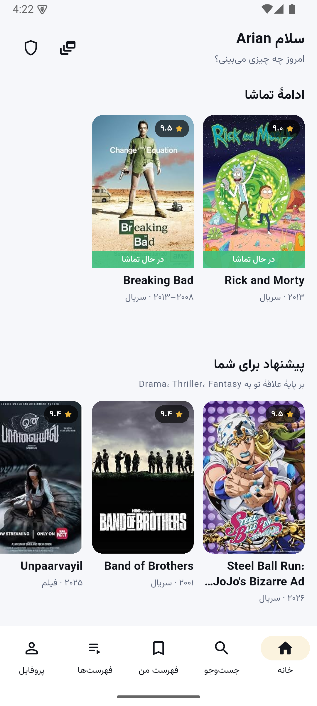
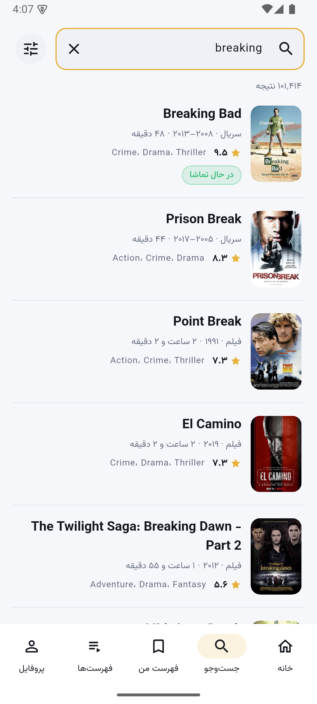
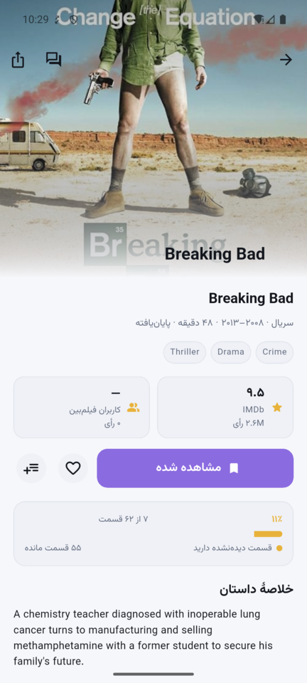
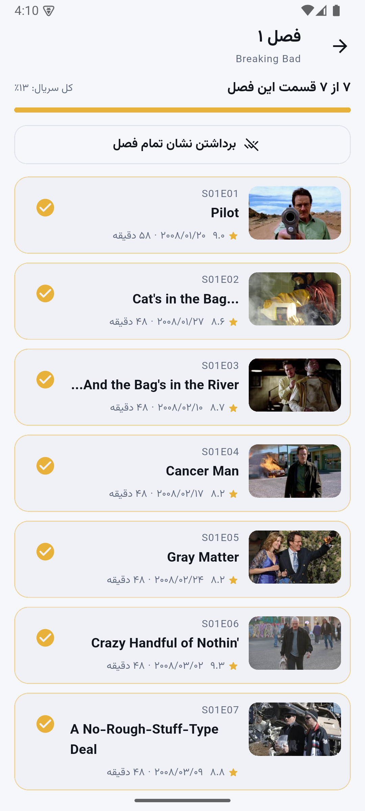
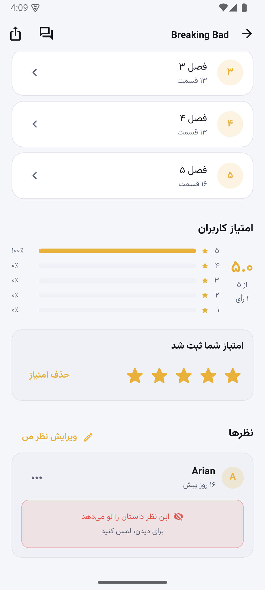
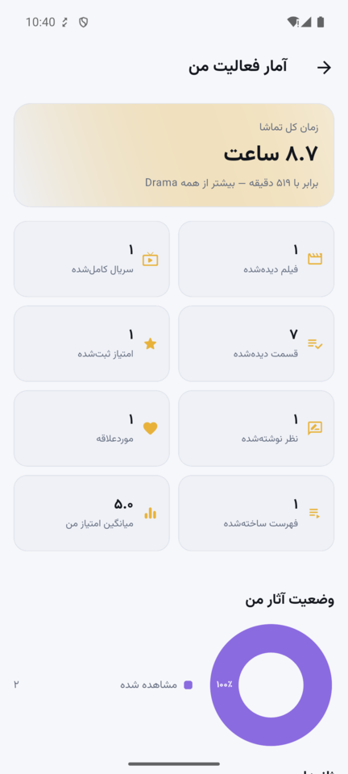
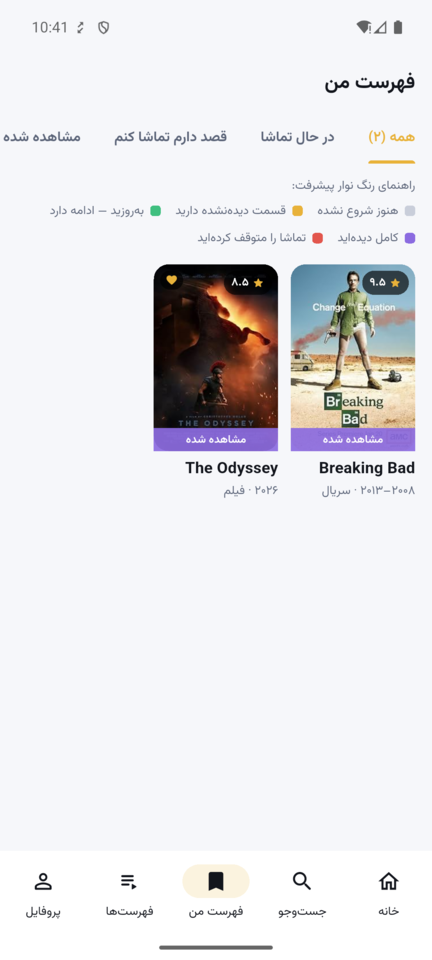
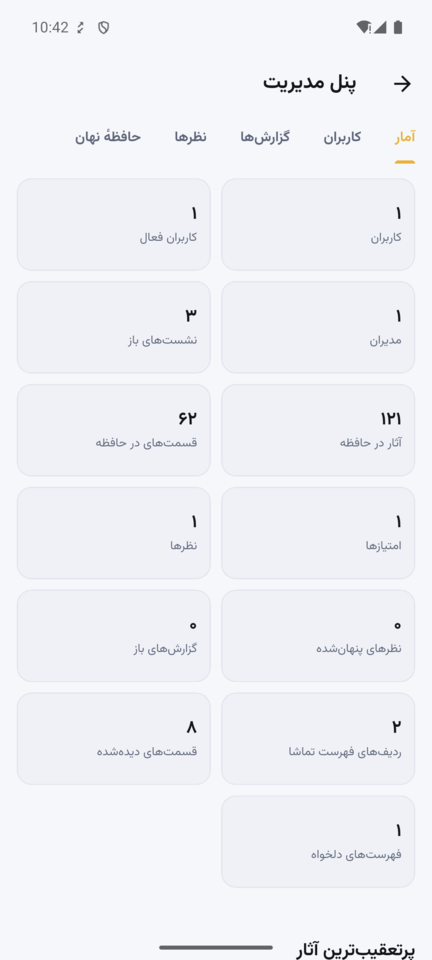
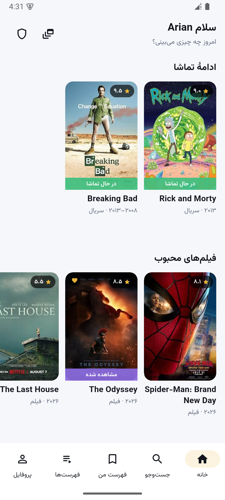

# فیلم‌بین

اپلیکیشن مدیریت و دنبال کردن فیلم و سریال — پروژهٔ درس **برنامه‌سازی موبایل (۴۰۴۲۹)**، دانشگاه صنعتی شریف.

**آرین اکبری — ۴۰۱۱۰۵۵۸۳**

پروژه با **مدل پیشرفته** (بخش ۷) پیاده شده است: اپلیکیشن هیچ‌وقت مستقیم با IMDb حرف نمی‌زند و
همه چیز از یک بک‌اند اختصاصی رد می‌شود.

```
Flutter (Android)  →  FastAPI  →  IMDb GraphQL
      ↓ sqflite            ↓ SQLite
   آینهٔ محلی            حافظهٔ نهان + آینهٔ آثار
```

---

## نگاه اول

| | | |
|---|---|---|
|  |  |  |
| صفحهٔ اصلی — ردیف‌های بخش ۵.۱۸ | جست‌وجو روی دادهٔ زندهٔ IMDb | جزئیات اثر + نوار پیشرفت |
|  |  |  |
| فهرست قسمت‌ها و «کل فصل را دیده‌ام» | ستاره‌ها، توزیع امتیاز و سپر اسپویل | داشبورد فعالیت (بخش ۵.۱۹) |
|  |  |  |
| فهرست تماشا با راهنمای رنگ | پنل مدیر (بخش ۴.۳) | همان صفحه، بدون هیچ اتصالی |

بقیهٔ تصویرها در `docs/screenshots/`.

**ویدیوها** در `docs/videos/` مخزن گیت هستند (به خاطر محدودیت حجم در بستهٔ ارسالی نیامده‌اند):

- `01-app-features.mp4` — نمایش امکانات اپلیکیشن
- `02-search-imdb.mp4` — جست‌وجو و دریافت اطلاعات از IMDb

مخزن: <https://github.com/Arian-Akbari/filmbin>

---

## راه‌اندازی

### ۱) بک‌اند

```bash
cd backend
python3 -m venv .venv
.venv/bin/pip install -r requirements-dev.txt
.venv/bin/uvicorn app.main:app --host 0.0.0.0 --port 8000
```

سلامت سرویس: <http://localhost:8000/api/v1/health> — مستندات تعاملی: <http://localhost:8000/docs>

### ۲) اپلیکیشن

```bash
cd app
flutter pub get
flutter run -d <device> --dart-define=API_BASE_URL=http://10.0.2.2:8000/api/v1
```

`10.0.2.2` یعنی «همین کامپیوتر» از دید شبیه‌ساز اندروید. روی دستگاه واقعی، IP کامپیوتر را بگذارید.

### ۳) ساخت خروجی

```bash
flutter build apk --release --dart-define=API_BASE_URL=https://<host>/api/v1
```

### اجرای امن (بخش ۸.۳)

```bash
cd backend && ./scripts/generate_certs.sh
.venv/bin/uvicorn app.main:app --host 0.0.0.0 --port 8443 \
    --ssl-certfile certs/server.crt --ssl-keyfile certs/server.key
```

اسکریپت اثر انگشت `SHA-256` را چاپ می‌کند؛ همان را به اپلیکیشن بدهید تا گواهی سنجاق شود:

```bash
flutter run --dart-define=API_BASE_URL=https://10.0.2.2:8443/api/v1 \
            --dart-define=PINNED_CERT_SHA256=<fingerprint>
```

### حساب مدیر

```bash
cd backend
.venv/bin/python scripts/manage.py create-admin --email admin@filmbin.ir --password 'Str0ngPass!'
```

---

## معماری

### بک‌اند — `backend/app/`

| پوشه | کارش |
|---|---|
| `core/` | تنظیمات، خطاهای یکدست، JWT و bcrypt، محدودیت نرخ، وابستگی‌های FastAPI |
| `db/` | مدل‌های SQLAlchemy (async) و باز کردن اتصال |
| `imdb/` | کوئری‌های GraphQL، کلاینت با **قطع‌کنندهٔ مدار**، نگاشت به مدل‌ها، لایهٔ حافظهٔ نهان |
| `services/` | منطق دامنه: پیشرفت تماشا، خلاصه‌سازی آثار، آمار، پیشنهادها، فعالیت |
| `schemas/` | قراردادهای ورودی/خروجی (Pydantic v2) |
| `api/routes/` | نقاط پایانی HTTP + وب‌سوکت گفت‌وگو |

پاسخ خطاها همه‌جا یک شکل دارد، تا اپلیکیشن یک مسیر برای نمایش خطا داشته باشد:

```json
{ "error": { "status": 404, "code": "TITLE_NOT_FOUND", "message": "…", "detail": "tt0000000" } }
```

### اپلیکیشن — `app/lib/`

| پوشه | کارش |
|---|---|
| `core/network/` | یک `ApiClient` روی Dio + میان‌افزارهای توکن/تلاش دوباره/حافظهٔ نهان + سنجاق گواهی |
| `core/storage/` | ذخیرهٔ امن توکن، آینهٔ sqflite، صندوق خروجی آفلاین، تنظیمات |
| `core/theme/` | تم تیره/روشن، رنگ وضعیت‌ها و **رنگ نوار پیشرفت** |
| `data/` | مدل‌ها و مخزن‌ها — تنها جایی که JSON دیده می‌شود |
| `presentation/providers/` | حالت برنامه با Riverpod |
| `presentation/screens/` | صفحه‌ها |
| `presentation/widgets/` | اجزای مشترک (پوستر، نوار پیشرفت، ستاره، حالت‌های خالی/خطا) |

مسیر یک نوشتن آفلاین: مخزن اول روی دیسک می‌نویسد → اگر شبکه نبود، درخواست در **صندوق خروجی**
می‌نشیند → دفعهٔ بعد که برنامه بالا می‌آید، صف پخش می‌شود.

---

## پوشش خواسته‌های صورت پروژه

### بخش ۵ — قابلیت‌های کارکردی

| بند | کجا |
|---|---|
| ۵.۱ ثبت‌نام | `screens/auth/register_screen.dart` |
| ۵.۲ ورود + «یک ماه مرا به خاطر بسپار» | `login_screen.dart`، نشست ۳۰ روزه در `routes/auth.py` |
| ۵.۳ بازیابی رمز | `forgot_password_screen.dart` |
| ۵.۴ پروفایل و ویرایش آن | `screens/profile/` |
| ۵.۵ جست‌وجو | `search_screen.dart` |
| ۵.۶ پالایه‌ها (ژانر، سال، نوع، بازیگر/کارگردان) | `FilterSheet` + `advancedTitleSearch` |
| ۵.۷ صفحهٔ اثر | `title/title_detail_screen.dart` |
| ۵.۸ فصل‌ها و قسمت‌ها | `title/season_screen.dart` |
| ۵.۹ وضعیت تماشا (۵ حالت) | `WatchStatus` + `routes/tracking.py` |
| ۵.۱۰ علامت‌گذاری قسمت و کل فصل | `EpisodeTile`، `_SeasonAction` |
| ۵.۱۱ نوار پیشرفت رنگی | `services/progress.py` + `widgets/progress_bar.dart` |
| ۵.۱۲ فهرست تماشا | `watchlist_screen.dart` |
| ۵.۱۳ امتیاز ۱–۵ و توزیع آن | `rating_widgets.dart` + `services/titles.py` |
| ۵.۱۴ نظر نوشتن | `ReviewComposer` |
| ۵.۱۵ هشدار اسپویل | `ReviewTile` + تنظیمات |
| ۵.۱۶ موردعلاقه | پرچم مستقل از وضعیت — `is_favorite` |
| ۵.۱۷ فهرست‌های دلخواه | `screens/lists/` |
| ۵.۱۸ صفحهٔ اصلی و ردیف‌ها | `home_screen.dart` + `/titles/discover` |
| ۵.۱۹ آمار فعالیت | `profile/stats_screen.dart` + `services/stats.py` |
| ۵.۲۰ رفتار در خطا | `ApiException` + `ErrorView` |

> **یادداشت دربارهٔ «موردعلاقه»:** در صورت پروژه هم به‌عنوان یک وضعیت و هم به‌عنوان فهرست جدا آمده.
> اینجا وضعیت‌ها پنج‌تا ماندند و «موردعلاقه» یک پرچم مستقل شد، چون یک اثر می‌تواند هم‌زمان
> «در حال تماشا» و «موردعلاقه» باشد.

### بخش ۷ — بک‌اند اختصاصی

واسط IMDb، حافظهٔ نهان چندلایه با TTL، آینهٔ محلی آثار/فصل‌ها/قسمت‌ها، قطع‌کنندهٔ مدار و
پاسخ از حافظه وقتی IMDb جواب نمی‌دهد، احراز هویت JWT با توکن تازه‌سازی چرخشی، نقش‌ها، و
مستندات OpenAPI فارسی روی `/docs`.

### بخش ۸ — نیازهای غیرکارکردی

| بند | چه شد |
|---|---|
| ۸.۱ کارایی | حافظهٔ نهان دو طرف، تصویرها در اندازهٔ نمایش، جست‌وجوی تأخیردار، اسکلت بارگذاری |
| ۸.۲ کاربردپذیری | فارسی و راست‌به‌چپ، ارقام فارسی، جهت متن بر پایهٔ محتوا (`BidiText`) |
| ۸.۳ امنیت | bcrypt، JWT کوتاه‌عمر، توکن تازه‌سازی به‌صورت درهم‌سازی‌شده، محدودیت نرخ، HTTPS + سنجاق گواهی |
| ۸.۴ اتکاپذیری | صندوق خروجی آفلاین، آینهٔ محلی، نشست آفلاین، عملیات خنثی‌پذیر |
| ۸.۵ سازگاری | تم تیره/روشن، محدود کردن بزرگ‌نمایی متن، چیدمان واکنش‌گرا |
| ۸.۶ نگه‌داری | لایه‌بندی روشن، تحلیلگر بدون هشدار، ۲۲۱ آزمون |
| ۸.۷ مقیاس‌پذیری | بی‌حالت بودن سرویس، آمادهٔ PostgreSQL از راه `DATABASE_URL` |
| ۸.۸ مصرف منابع | تصویرها با اندازهٔ درخواستی، حالت کم‌مصرف، فشرده‌سازی GZip |

### بخش ۱۳ — امتیازی

پیشنهاد هوشمند بر پایهٔ ژانرهای واقعی کاربر (و پنهان ماندنش تا وقتی سیگنالی نیست)،
دنبال کردن کاربران و خوراک فعالیت، هم‌رسانی اثر و فهرست، و اتاق گفت‌وگوی زندهٔ هر اثر روی وب‌سوکت.

---

## آزمون‌ها

```bash
cd backend && .venv/bin/python -m pytest      # ۱۱۵ آزمون
cd app     && flutter test                    # ۱۰۶ آزمون
cd app     && flutter analyze                 # بدون هشدار
```

آزمون‌های زندهٔ IMDb به‌طور پیش‌فرض اجرا نمی‌شوند (چون به اینترنت وابسته‌اند):

```bash
cd backend && .venv/bin/python -m pytest -m live
```

---

## نکته‌های محیطی

روی شبکه‌هایی که به Maven گوگل دسترسی ندارند، Gradle نمی‌تواند AGP را بگیرد. برای همین در
`android/settings.gradle.kts` و `android/build.gradle.kts` یک آینهٔ در دسترس **قبل از** `google()`
آمده است؛ روی شبکهٔ عادی همان `google()` جواب می‌دهد و چیزی عوض نمی‌شود.
